# Real-time Interaction Analytics 📊🚀

An end-to-end demo stack that **generates synthetic e-commerce traffic, streams it through Kafka + Spark Structured Streaming, aggregates in Elasticsearch, and visualises live KPIs in Kibana**.

<p align="center">
  
</p>

---

## Table of Contents
1. [Key Features](#key-features)  
2. [Architecture](#architecture)  
3. [Data Model](#data-model)  
4. [Quick Start (1-liner)](#quick-start)  
5. [Detailed Setup](#detailed-setup)  
6. [Project Layout](#project-layout)  
7. [Configuration](#configuration)  
8. [Operations & Monitoring](#operations--monitoring)  
9. [Testing](#testing)  
10. [Troubleshooting](#troubleshooting)  
11. [Road-map](#road-map)  
12. [License](#license)

---

## Key Features
| Layer | What it does | Where |
|-------|--------------|-------|
| **Producer** | Generates realistic user → item events (session-based funnel, Zipf popularity, 10 k users, 2 k SKUs) and pushes JSON to Kafka. | `producer/producer.py` |
| **Kafka** | Buffer & fan-out (Confluent images). | `docker-compose.yml` |
| **Spark Structured Streaming** | 1-second tumbling window → min/max per item, rolling per-user totals, global average; writes to Elasticsearch with idempotent upserts. | `spark/spark_job.py` |
| **Elasticsearch** | Time-series indices: `interaction-agg_item`, `interaction-agg_user`, `interaction-agg_avg`. | `docker-compose.yml` |
| **Kibana** | Auto-refreshing dashboard (import via `dashboard.ndjson`). | `dashboard.ndjson` |
| **Docker Compose** | One-command local stack incl. Zookeeper, Kafka, Spark, Elasticsearch, Kibana, Producer. | `docker-compose.yml` |

---

## Architecture

```mermaid
flowchart LR
    G[🖥️ Synthetic<br>Generator] -->|JSON events| K((Apache Kafka))
    K --> S[Spark<br>Structured Streaming]
    S -->|window 1 s<br>aggregates| ES[(Elasticsearch)]
    S -->|checkpoints| FS[(S3-style FS)]
    ES -->|HTTP| KB[Kibana<br>Dashboard]

    style G fill:#f39c12,color:#fff
    style K fill:#34495e,color:#fff
    style S fill:#27ae60,color:#fff
    style ES fill:#e67e22,color:#fff
    style KB fill:#2980b9,color:#fff
```


---

## Data Model
| Entity / Index | Key | Important Fields |
|----------------|-----|------------------|
| **RawEvents** (Kafka) | `event_id` | `session_id, user_id, item_id, category, price_usd, interaction_type, timestamp` |
| **SparkWindow1s** (temp) | — | `item_id, window_start, cnt` |
| **ItemAgg** (`interaction-agg_item`) | `item_id` | `max_per_sec, min_per_sec, total_interactions, @timestamp` |
| **UserAgg** (`interaction-agg_user`) | `user_id` | `total_interactions, @timestamp` |
| **AvgAgg** (`interaction-agg_avg`) | `"global"` | `avg_interactions_per_user, @timestamp` |

---

## Quick Start
```bash
git clone <repo>
cd realtime-interaction-analytics
cp .env.example .env          # tweak if needed
docker compose up --build -d  # ⏳ first run ~2-3 min
```
Open <http://localhost:5601> → **Stack Management → Saved Objects → Import → `dashboard.ndjson`** → Dashboard “Real-time Interaction Overview” → set time-picker *Last 15 minutes* & Auto-refresh **5 s**.

---

## Detailed Setup

### 1 — Prerequisites
* Docker 20 + Compose v2  
* 8 GB RAM free (Elasticsearch needs ~4 GB)  
* Ports 2181, 9092, 9200, 5601 free

### 2 — Environment variables (`.env`)
| Var | Default | Used by |
|-----|---------|---------|
| `KAFKA_BROKER` | `kafka:9092` | Producer, Spark |
| `KAFKA_TOPIC`  | `user_interactions` | Producer, Spark |
| `ELASTICSEARCH_HOST` | `http://elasticsearch:9200` | Spark |
| … | see `.env` | |

### 3 — Bring up the stack
```bash
docker compose up --build -d
docker compose logs -f producer spark
```

Services started: **zookeeper, kafka, producer, spark, elasticsearch, kibana**.

### 4 — Import Kibana objects
```bash
curl -X POST --form file=@dashboard.ndjson \
     http://localhost:5601/api/saved_objects/_import?createNewCopies=false \
     -H "kbn-xsrf: true"
```

### 5 — Watch it live  
Dashboard auto-refreshes every 5 s; metrics stabilize after ~30 s of data.

---

## 📊 Real-time Monitoring Dashboard

<p align="center">
  
</p>

## Project Layout
```
realtime-interaction-analytics/
├─ producer/                 # Python 3.10 generator + Dockerfile
│  ├─ producer.py
│  └─ requirements.txt
├─ spark/
│  └─ spark_job.py           # Aggregator (PySpark 3.5)
├─ docker-compose.yml
├─ dashboard.ndjson          # Kibana saved objects (7.17+)
├─ img/                      # Architecture / data-model PNGs
├─ .env                      # Config overrides
└─ logs/                     # Rotating Spark & Producer logs
```

---

## Configuration
* **Event rate** – `producer/producer.py --rate 500` or env `EVENT_RATE=500`.  
* **Window size** – change `"1 second"` in `spark_job.py`.  
* **Elasticsearch shards** – edit `docker-compose.yml` env `ES_JAVA_OPTS` / shard count.  

All changes on restart: `docker compose restart <service>`.

---

## Operations & Monitoring
| Component | Health / Metrics |
|-----------|------------------|
| Kafka     | `docker exec -it kafka kafka-topics --bootstrap-server kafka:9092 --describe --topic user_interactions` |
| Spark     | Web UI <http://localhost:4040> (batch DAGs, throughput) |
| Elasticsearch | <http://localhost:9200/_cat/indices?v> |
| Kibana    | <http://localhost:5601> |

Logs rotate under `logs/`.

---

## Testing
```bash
# Unit test core aggregation logic
pip install pytest pyspark==3.5.0
pytest tests/
```
Micro-bench (30 s @ 5 k eps) peaks at **~1.2 MB/s** Kafka in, Spark micro-batch latency ~200 ms on 4 vCPU laptop.

---

## Troubleshooting
| Symptom | Fix |
|---------|-----|
| Kibana import fails “Unexpected end of JSON” | Ensure file has **one JSON object per line**, no trailing commas. |
| Spark throws watermark correctness error | We disabled multi-stage stateful ops; if you changed the job, keep one stateful op per query or set `spark.sql.streaming.statefulOperator.checkCorrectness.enabled=false`. |
| ES index red | Increase Docker RAM (`ES_JAVA_OPTS`) or lower producer rate. |

---

## Road-map
* Flink replacement for Spark  
* Avro schema registry & Kafka Connect sink  
* Grafana + Prometheus side-car  
* Terraform module for AWS EKS deployment

---

## License
Apache 2.0 — see `LICENSE`.

---

*Generated & manually reviewed — enjoy!*